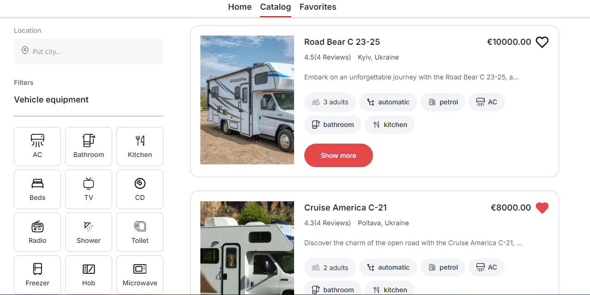
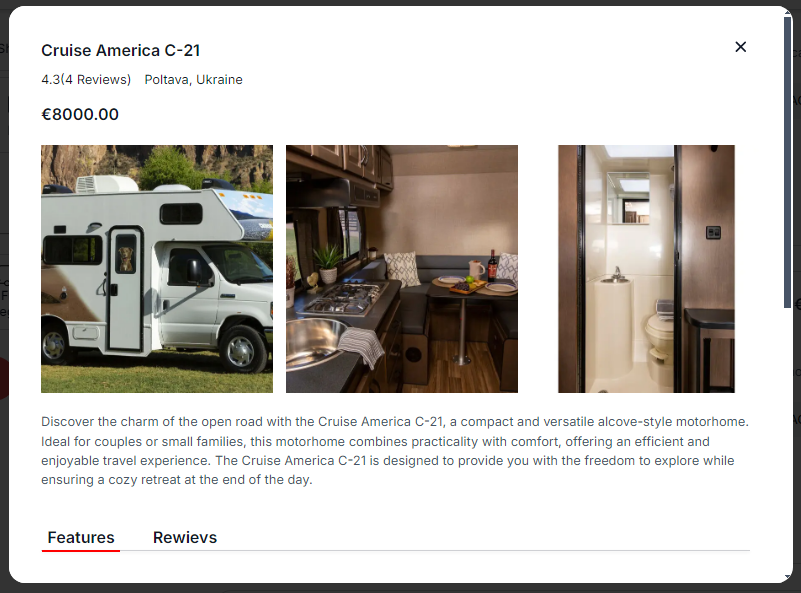
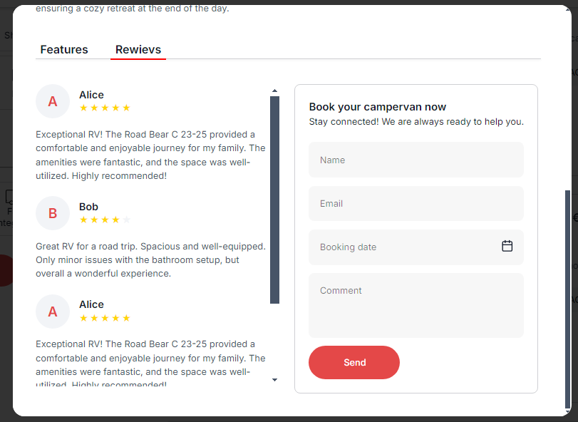
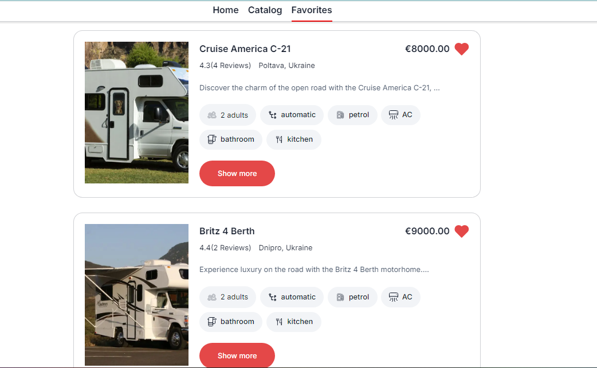

# Test task

`CampRent` - `three pages web-application of renting camp for your traveling.`

1. Home: page with general information about the service.
2. Catalog: page of advertises with any kind of camp type with different
   options.
3. Favorites: page of your favorite advertises.

## Tech stack:

- Create React App
- HTML / CSS
- Java Script
- React
- Redux
- Axios
- Mockapi

### How to Run the Application:

- Clone the repository.
- Install dependencies using `npm install`.
- Start the development server using `npm start`.

  ### Feedback

* author:
  [Kostiantyn Baltakov](https://github.com/Baltakov/tt-camper/ 'project link')
* In case of questions please contact [tira2500@gmail.com]

### Desing

Design of the project from
[layout](https://www.figma.com/file/fnMWH0eBB7NnoqdAiiKWsQ/Test?type=design&node-id=0-1&mode=design 'Figma link')

 
 
